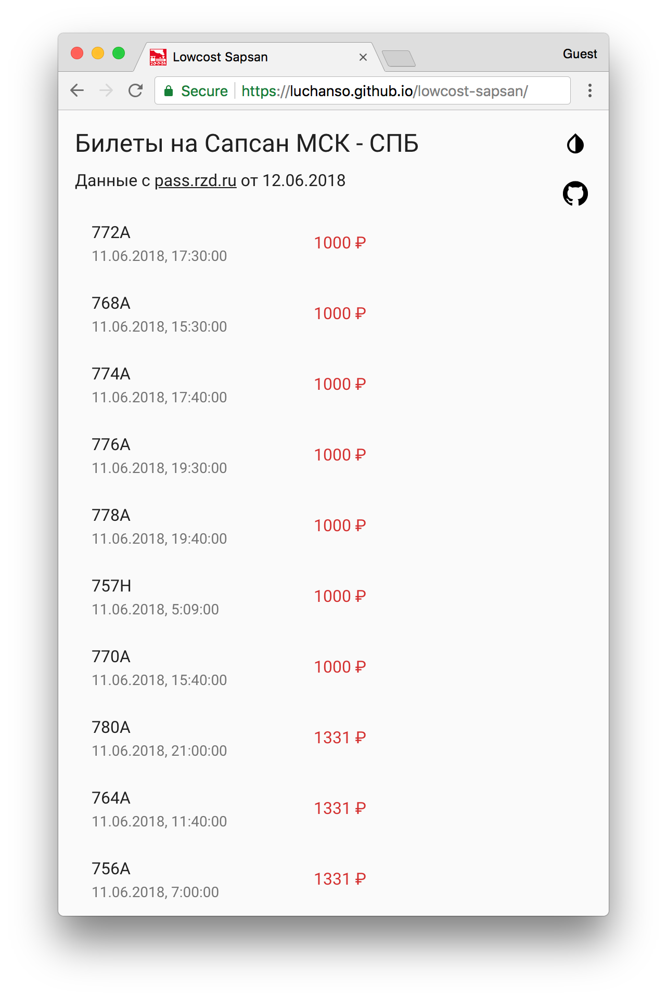

# Lowcost sapsan
Service for search cheaper tickets on Sapsan train


## Install and run
```sh
git clone git@github.com:Luchanso/lowcost-sapsan.git
cd lowcost-sapsan
yarn
yarn grab # for fetching data. It will work ~400 sec.
yarn start # for view parsed data
```

## Color palette
You can find colors value in [src/theme.js](https://github.com/Luchanso/lowcost-sapsan/blob/master/src/theme.js)


## Other licenses
Steam locomotive icon (favicon.ico) by [Delapouite](http://delapouite.com/) under [CC BY 3.0](https://creativecommons.org/licenses/by/3.0/)
